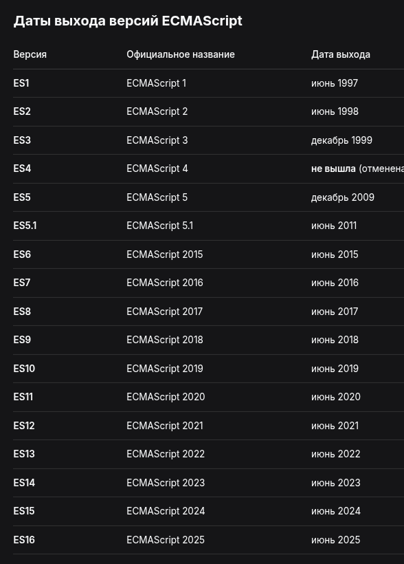

## Кофигурируем компилятор TS

Компилятор TypeScript можно устанавливать настройки.

### Автоматическая перекомпиляция. Флаг --watch или -w

Если в .ts файл внесено изменение - оно автоматом 
перекомпилируется, не надо будет компилировать из терминала
каждый раз.

```bash
tsc -w app.ts
```

### Задать версию ES (EcmaScript это название JS в оф доках, чтобы не злить Oracle с их брендом на Java)

```bash
# Устанавливаем 5 версию EcmaScript
tsc app.ts -t ES5
```

### Подробнее о версиях ES (версиях JavaScript)



То есть сейчас версии ES выходят каждый июнь стабильно.
И сейчас как раз юзают ES12-ES17

### Удаление комментариев --removeComments

Чтобы компилятор TS не включал комментарии при ковертации .ts
файлов в .js файлы

```bash
tsc app.ts --removeComments
```

### Установка пути для сохранения скомпилированных .js файлов

```bash
tsc --outDir ./somedir/ app.ts
```

### Объединение файлов

При компиляции можно собрать много .ts файлов в меньшее (или вообще в один) .js файлов

```bash
tsc --outFile output.js app.ts hello.ts
```

### Тип модуля, который будет юзаться при компиляции

Эта опция может принимать значения

- None
- CommonJS
- AMD
- System
- UMD
- ES2015
- ES2020
- ESNext


